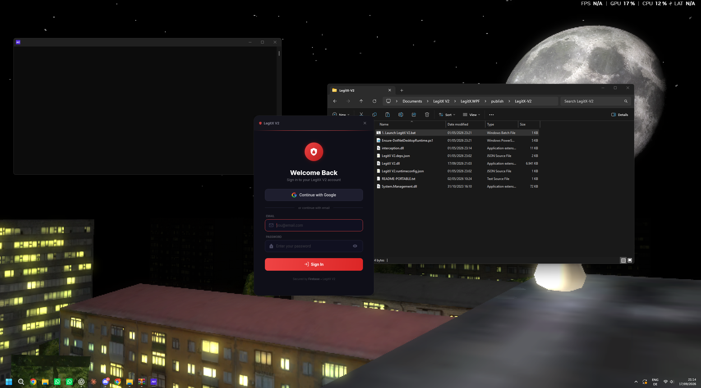
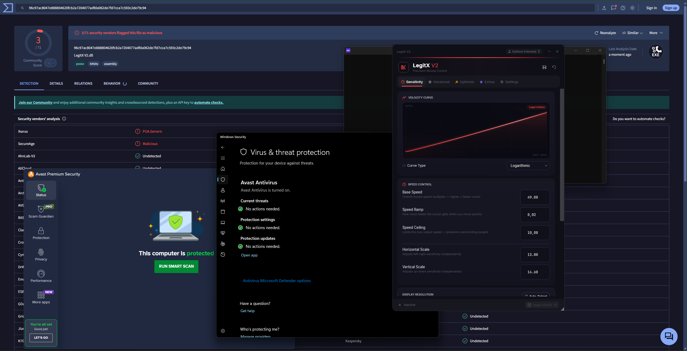

# 🔴 LegitX V2 - Open-Source Mouse Sensitivity and Optimization Suite

> **Advanced Mouse Sensitivity Engine & PC Optimization Suite**
> Built for competitive mobile gamers using Android emulators (BlueStacks / MSI App Player)

LegitX V2 is an open-source Windows desktop and web-management project for mouse sensitivity tuning, DPI profiles, emulator optimization, and license administration. It includes a .NET 8 WPF client plus React/Firebase admin, reseller, and user panels.

---

## 📦 Project Structure

```
LegitX V2/
├── LegitX.WPF/              # Desktop Application (.NET 8 / WPF / C#)
│   ├── Services/             # Core services (Auth, License, HWID, Security, etc.)
│   ├── ViewModels/           # MVVM ViewModels
│   ├── Views/                # XAML Windows & Dialogs
│   ├── Controls/             # Custom WPF controls
│   ├── Converters/           # Value converters
│   ├── Themes/               # Dark theme resources
│   └── Assets/               # Icons, logos, fonts
├── admin-panel/              # Admin Dashboard (React + TypeScript + Vite)
├── user-panel/               # User Dashboard (React + TypeScript + Vite)
├── reseller-panel/           # Reseller Dashboard (React + TypeScript + Vite)
├── firestore.rules           # Firebase Firestore security rules
├── firebase.json             # Firebase hosting & deployment config
└── LegitX V2.sln             # Visual Studio solution file
```

## Screenshots





The attached VirusTotal result shows `3/71` security vendors flagging the analyzed DLL. That sample was compiled with .NET Reactor obfuscation. Obfuscation can produce heuristic detections, but this is not proof that a detection is a false positive; review the source, dependencies, and build artifact independently before distributing it.

---

## 🖥️ Desktop Application (LegitX.WPF)

### Tech Stack
- **.NET 8** — Windows Presentation Foundation (WPF)
- **C#** — Self-contained EXE, x64
- **Firebase REST API** — Authentication, Firestore database (no SDK)
- **WMI (System.Management)** — Hardware identification
- **Google OAuth 2.0** — Desktop authorization flow with PKCE
- **Interception driver / Win32 APIs** — Low-level mouse input and driver integration
- **MVVM** — ViewModels, commands, XAML views, and resource dictionaries
- **Build tooling** — `dotnet`, MSBuild, Fody/Costura, optional ConfuserEx hardening scripts

### Features

| Category | Details |
|----------|---------|
| **Mouse Sensitivity Engine** | 16-stage unified aim pipeline with Bézier velocity curves, sub-pixel accumulation, sensitivity-adaptive smoothing, auto deadzone, anti-overshoot |
| **Advanced Controls** | Per-axis (X/Y) sensitivity, acceleration toggle, smoothing intensity, dead zone, jitter filter, snap assist, drift correction |
| **PC Optimization** | System cleaner, privacy clean, registry optimizer, FPS boost presets |
| **Emulator Integration** | Auto-detect BlueStacks/MSI App Player, resolution detection, emulator optimization |
| **Driver Management** | Mouse driver status check, driver restart, full driver report |
| **Display Detection** | Monitor refresh rate, resolution, recommended settings |

### Authentication & Licensing
- **Email/Password** login via Firebase Auth REST API
- **Google OAuth 2.0** desktop flow with PKCE
- **Password reset** via email
- **License system** — Trial (time-limited) and Permanent keys
- **Redemption codes** — Admin/reseller-created, single-use binding

### Local Authentication Testing

The public build does not contain a universal `admin` / `1` login. A fixed credential would bypass Firebase security for every installation. For local testing, create a test user in your Firebase project (or Firebase Auth Emulator), configure the variables in [AUTHENTICATION_SETUP.md](AUTHENTICATION_SETUP.md), and use that account. Keep test credentials outside the repository and use a strong password even in development.

### Hardware ID Lockdown (2-Layer System)

| Layer | Components | Purpose |
|-------|-----------|---------|
| **Permanent** | CPU ID, Motherboard Serial, BIOS Serial, SMBIOS UUID, Disk Serial, TPM ID | Never changes — survives OS reinstall |
| **Windows** | Machine GUID, Product ID, Computer Name, Build, Install Date | Changes on OS reinstall — admin can reset |

### Security Hardening

| Layer | Protection |
|-------|-----------|
| **Anti-Debugger** | `IsDebuggerPresent`, `CheckRemoteDebuggerPresent`, `NtQueryInformationProcess` (DebugPort, DebugObjectHandle, DebugFlags), `Debugger.IsAttached`, hardware breakpoint detection (DR0-DR7), CloseHandle trap, OutputDebugString check, timing anomaly detection |
| **Anti-Tamper** | SHA-256 assembly hash verification, module count monitoring (DLL injection detection), assembly integrity re-checks |
| **Process Protection** | Detects 100+ known cracking/reversing tools (dnSpy, ILSpy, x64dbg, Cheat Engine, Ghidra, Fiddler, Wireshark, Process Hacker, etc.) |
| **Memory Protection** | PE header erasure (anti-dump), suspicious DLL detection (ScyllaHide, SharpOD, speedhack, etc.) |
| **API Configuration** | Firebase and Google OAuth values are supplied locally through environment variables; no project credentials are committed |
| **SSL Pinning** | Custom `HttpClientHandler` pins to Google Trust Services root CAs — blocks MITM from Fiddler, Charles, Burp Suite, mitmproxy |
| **Continuous Monitoring** | Background thread scans every 3-8s (randomized). Violation → session wipe → secrets purge → `Environment.FailFast()` |
| **Thread Hiding** | `NtSetInformationThread(ThreadHideFromDebugger)` on security threads |

---

## 🌐 Web Panels

All three web panels share the same tech stack and design language.

### Tech Stack
- **React 19** + **TypeScript ~5.9**
- **Vite 8** — Build tool
- **Firebase 12** — Auth + Firestore
- **Lucide React** — Icons
- **Pure CSS** — Custom dark theme (black & red), no Tailwind
- **Firebase Hosting** — Deployment target configured in `firebase.json`

### Admin Panel (`admin-panel/`)

| Feature | Description |
|---------|-------------|
| **Dashboard** | User count, license stats, recent activity |
| **Users Tab** | Full user management — view, edit, delete, deactivate, suspend, system ban (HWID ban) |
| **User Detail** | License info, HWID data, feature flags toggle, activity logs, Windows Reset / Full Account Reset |
| **Licenses Tab** | Create trial/permanent codes, activate/deactivate, view redemption status |
| **Resellers Tab** | Create/manage reseller accounts with Role-Based Access Control (5 permission categories) |
| **Logs Tab** | Per-user activity logs, admin action audit trail |
| **Site Config** | Manage download page content (hero text, download links, changelog) |
| **Security** | Rate limiting, input sanitization, session management (2hr timeout + 30min idle), CSP headers, anti-tamper |

### User Panel (`user-panel/`)

| Feature | Description |
|---------|-------------|
| **Login** | Email/password, Google OAuth, registration with email verification, password reset |
| **Dashboard** | Account overview, license status, subscription details |
| **Profile** | View account info, email, creation date |
| **License** | View plan type, trial countdown, expiry date |
| **Hardware** | View registered HWID, self-service HWID reset (30-day cooldown) |
| **Redeem** | Enter and activate license/redemption codes |
| **Security** | Rate limiting, input sanitization, session management (4hr timeout), CSP headers, anti-tamper |

### Reseller Panel (`reseller-panel/`)

| Feature | Description |
|---------|-------------|
| **Login** | Email/password authentication against resellers collection |
| **Dashboard** | Created users/licenses count, recent activity |
| **Users** | View users created by this reseller, manage within RBAC permissions |
| **Licenses** | Create codes (within allowed plan types), view/manage created licenses |
| **Security** | Rate limiting, input sanitization, session management (3hr timeout + 30min idle), CSP headers, anti-tamper |

---

## 🔥 Firebase Backend

### Firestore Collections

| Collection | Purpose |
|-----------|---------|
| `users/{uid}` | User profiles, license status, account status |
| `users/{uid}/features/flags` | Per-user feature flags (bypass, streamerMode, formBypass, stopNetwork) |
| `users/{uid}/hwid/data` | Hardware ID registration (permanent + windows hashes) |
| `licenses/{code}` | License codes with plan type, trial days, redemption status |
| `banned_hwids/{hash}` | Hardware-banned PC hashes |
| `resellers/{id}` | Reseller accounts with RBAC permissions |
| `admins/{uid}` | Admin accounts |
| `admin_logs/{id}` | Admin action audit trail |
| `site_config/{docId}` | Website configuration (download page content) |

### Firestore Security Rules
- Authenticated read/write with field-level validation
- License codes: size validation (10-30 chars)
- Reseller RBAC enforcement
- Admin logs: write-once (immutable)
- Catch-all deny rule for undefined paths

---

## 🛠️ Development

### Prerequisites
- **Windows 10/11** (x64)
- **.NET 8 SDK**
- **Node.js 18+** & npm
- **Visual Studio 2022** or **VS Code**
- **Firebase CLI** (for deploying rules & hosting)

### Build — Desktop App
Open **`LegitX V2.sln`** (includes **LegitX.WPF**), or from a terminal:

```bash
cd LegitX.WPF
dotnet build -c Release
```

If **`dotnet publish`** / single-file release fails with **`apphost.exe` / MSB3030**, the repo path likely contains **`(`** or **`)`** (e.g. `Copy (3)`). Use a folder path without parentheses, or run **`scripts\hardened-release.ps1`** from such a path (the script checks this before publish).

### Hardened Release Build (recommended)
```powershell
.\scripts\hardened-release.ps1
```

This does:
- Single-file self-contained publish (`win-x64`)
- Removes debug symbols
- Enables ReadyToRun + compression
- Obfuscates the app assembly first (ConfuserEx), then publishes with `--no-build`

Example with explicit Confuser path:
```powershell
.\scripts\hardened-release.ps1 `
  -ConfuserCliPath ".\tools\ConfuserEx\Confuser.CLI.exe" `
  -ObfuscationProfile aggressive
```

If you need a quick build without obfuscation:
```powershell
.\scripts\hardened-release.ps1 -SkipObfuscation
```

### Build — Web Panels
```bash
# Admin Panel
cd admin-panel && npm install && npx vite build

# User Panel
cd user-panel && npm install && npx vite build

# Reseller Panel
cd reseller-panel && npm install && npx vite build
```

### Deploy — Firestore Rules
```bash
firebase deploy --only firestore:rules
```

### Deploy — Web Panels (Firebase Hosting)
```bash
firebase deploy --only hosting
```

---

## 🔒 Security Notice

This open-source repository does not contain Firebase API keys, Google OAuth secrets, or AI provider credentials. The desktop client and web panels read configuration from environment variables and show `PASTE YOUR ... HERE` placeholders when values are not configured. See [AUTHENTICATION_SETUP.md](AUTHENTICATION_SETUP.md) before running an authenticated build.

**Never commit plaintext API keys, OAuth secrets, signing keys, or service-account files.** Firebase web API keys are not a substitute for Firestore rules; review `firestore.rules` and configure the project-specific admin email before deployment. See [SECURITY.md](SECURITY.md) for private vulnerability reporting.

## Anti-Reverse Reality Check

- A pure .NET assembly can always be decompiled to some degree.
- Runtime anti-debug helps, but **release obfuscation** is the key control against dnSpy/ILSpy readability.
- For strongest protection, add a commercial obfuscator/virtualizer in CI before shipping.

---

## 📄 License and open-source status

LegitX V2 is open source under the [MIT License](LICENSE). The license permits use, modification, redistribution, and commercial use provided the copyright and license notice are retained.

Review third-party terms before redistributing bundled fonts, icons, the Interception driver, Firebase assets, Fody/Costura, ConfuserEx, or any externally linked download. Obfuscation and anti-tamper controls do not make a .NET binary impossible to inspect; publish source, build instructions, checksums, and release notes together.

## GitHub protection and release hygiene

- Keep the default branch protected with pull requests, required checks, and restricted force-push/deletion permissions.
- Enable secret scanning, push protection, Dependabot alerts, and dependency review on the GitHub repository.
- Build releases from a clean checkout, publish SHA-256 checksums, and record the exact commit and configuration used.
- Do not commit `.env` files, Firebase service-account JSON, OAuth secrets, signing keys, or local `publish/` output.
- Report suspected vulnerabilities privately using [SECURITY.md](SECURITY.md), not through a public issue with exploit details.

## Community

Join the [LegitX V2 Discord community](https://discord.gg/Vs9sM8cZw5) for discussion, troubleshooting, and release updates.
